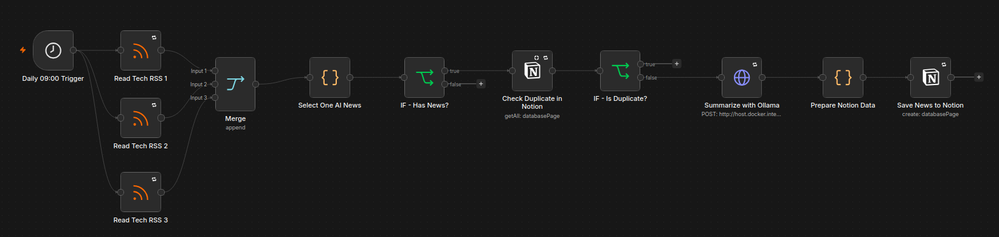
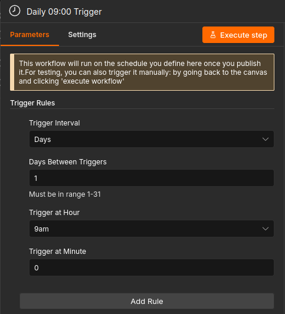
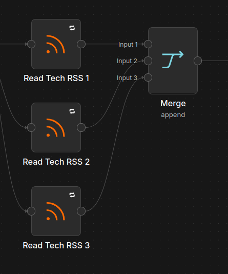
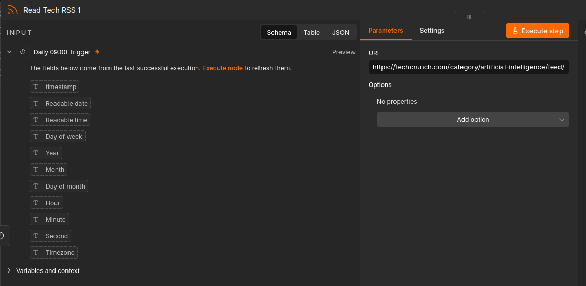
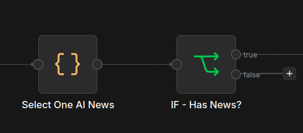
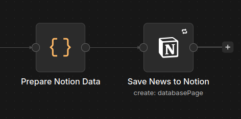
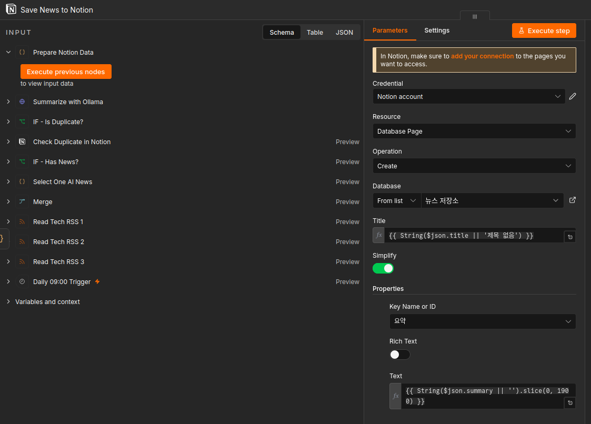
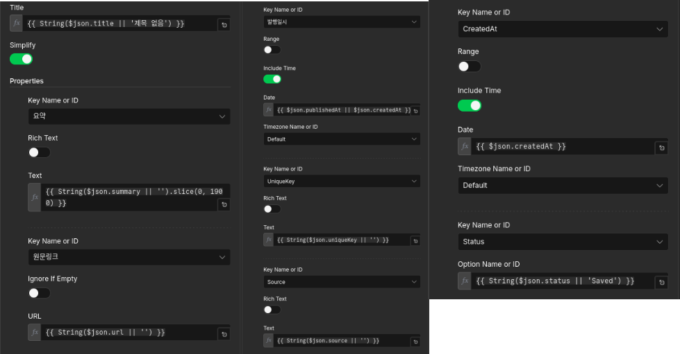

------

# 산출물 1. 자동화 워크플로우 문서


## 1. 워크플로우 개요

본 워크플로우는 n8n을 활용하여 **AI 관련 뉴스를 매일 자동으로 수집, 필터링, 요약, 저장**하는 자동화 시스템이다.

매일 오전 09:00에 자동 실행되며, 3개의 RSS 피드에서 최신 뉴스를 수집한다. 이후 AI 관련 키워드가 포함된 기사만 선별하고, Notion 데이터베이스에서 중복 여부를 확인한 뒤, 중복되지 않은 기사만 Ollama LLM으로 한국어 요약하여  Notion에 저장한다.

------

## 2. 자동 실행 설정

### 실행 방식

워크플로우는 n8n의 **Schedule Trigger**를 사용하여 정해진 시간에 자동 실행된다.

| 항목            | 설정값                  |
| --------------- | ----------------------- |
| 실행 방식       | Schedule Trigger        |
| 실행 주기       | 매일                    |
| 실행 시간       | 오전 09:00              |
| 워크플로우 상태 | Published / Active 상태 |

### 설명

Schedule Trigger 노드는 사용자가 직접 실행하지 않아도 지정된 시간에 워크플로우를 자동으로 시작한다.
따라서 본 워크플로우는 매일 오전 09:00에 AI 뉴스 수집 프로세스를 자동으로 수행한다.

------

## 3. 전체 워크플로우 구조

### 전체 흐름

text

```
Schedule Trigger
        ↓
RSS Feed 1: TechCrunch AI
RSS Feed 2: MIT Technology Review
RSS Feed 3: GeekNews
        ↓
Merge
        ↓
AI 뉴스 필터링
        ↓
최신 기사 선택
        ↓
Notion 중복 확인
        ↓
IF 중복 여부 판단
   ├─ 중복 있음 → 종료
   └─ 중복 없음
          ↓
      Ollama 한국어 요약
          ↓
      Notion 뉴스 저장
```

------

## 4. 워크플로우 구조 스크린샷

### [스크린샷 1] 전체 워크플로우 화면



설명:

이 화면은 전체 자동화 흐름을 보여준다.
Schedule Trigger에서 시작하여 RSS 수집, 필터링, 중복 확인, AI 요약, Notion 저장까지 모든 노드가 순차적으로 연결되어 있다.

------

### [스크린샷 2] Schedule Trigger 설정 화면



설명:

Schedule Trigger는 워크플로우의 시작점이다.
설정된 시간인 매일 오전 09:00에 자동으로 실행되어 전체 뉴스 수집 프로세스를 시작한다.

------

### [스크린샷 3] RSS Feed 수집 노드 화면





> 설명:

RSS Feed Read 노드는 외부 뉴스 사이트에서 최신 기사를 가져오는 역할을 한다.
본 프로젝트에서는 AI 및 기술 관련 뉴스를 수집하기 위해 총 3개의 RSS 피드를 사용하였다.

------

### [스크린샷 4] AI 뉴스 필터링 Code 노드 화면



.item.json.title || "") + "\n\n본문: " + (($('Select One AI News').item.json.content || "").slice(0, 3000)) + "\n\nURL: " + ($('Select One AI News').item.json.link || "")) }},
  "stream": false
}
```

설명:

중복되지 않은 기사만 Ollama LLM에 전달하여 한국어 요약을 생성한다.
요약 결과는 3개의 핵심 문장과 핵심 키워드 형태로 생성된다.

------

### [스크린샷 7] Notion 저장 노드 화면







설명:

요약이 완료된 뉴스는 Notion 데이터베이스에 저장된다.
저장되는 정보는 기사 제목, 요약, 원문 링크, 발행일시, 출처, UniqueKey, 저장 상태 등이다.

------

## 5. 단계별 역할 및 연결 구조

| 단계 | 노드             | 역할                                   | 다음 연결                   |
| ---- | ---------------- | -------------------------------------- | --------------------------- |
| 1    | Schedule Trigger | 매일 오전 09:00 워크플로우 자동 실행   | RSS Feed 노드               |
| 2    | RSS Feed Read 1  | TechCrunch AI 뉴스 수집                | Merge                       |
| 3    | RSS Feed Read 2  | MIT Technology Review 뉴스 수집        | Merge                       |
| 4    | RSS Feed Read 3  | GeekNews 뉴스 수집                     | Merge                       |
| 5    | Merge            | 여러 RSS 결과를 하나로 통합            | AI 뉴스 필터링              |
| 6    | AI 뉴스 필터링   | AI 관련 키워드가 포함된 기사만 선별    | 최신 기사 선택              |
| 7    | 최신 기사 선택   | 발행일 기준 최신 기사 1건 선택         | Notion 중복 확인            |
| 8    | Notion 중복 확인 | UniqueKey 기준으로 기존 저장 여부 확인 | IF 중복 판단                |
| 9    | IF 중복 판단     | 중복 여부에 따라 흐름 분기             | 중복이면 종료 / 신규면 요약 |
| 10   | Ollama 요약      | 기사 내용을 한국어로 요약              | Notion 저장                 |
| 11   | Notion 저장      | 요약 결과를 Notion DB에 저장           | 종료                        |

------

## 6. 각 단계 상세 설명

### 6.1 Schedule Trigger

Schedule Trigger는 워크플로우의 시작 노드이다.
매일 오전 09:00에 자동 실행되도록 설정되어 있으며, 이 노드가 실행되면 전체 프로세스가 시작된다.

text

```
Schedule Trigger
→ RSS Feed Read 노드 실행
```

------

### 6.2 RSS 뉴스 수집

총 3개의 RSS Feed Read 노드를 사용하여 다양한 출처에서 뉴스를 수집한다.

| RSS 출처              | 목적                                   |
| --------------------- | -------------------------------------- |
| TechCrunch AI         | AI 산업 및 스타트업 관련 뉴스 수집     |
| MIT Technology Review | 기술 트렌드 및 연구 중심 뉴스 수집     |
| GeekNews              | 개발자 및 기술 커뮤니티 기반 뉴스 수집 |

각 RSS 노드는 외부 네트워크 오류에 대비하여 재시도 설정을 적용하였다.

text

```
실패 시 최대 2회 재시도
```

------

### 6.3 RSS 결과 통합

Merge 노드는 여러 RSS 노드에서 수집한 데이터를 하나의 흐름으로 합친다.
이를 통해 이후 단계에서 모든 뉴스를 동일한 기준으로 필터링할 수 있다.

text

```
RSS 1
RSS 2
RSS 3
  ↓
Merge
```

------

### 6.4 AI 관련 뉴스 필터링

Code 노드에서 기사 제목, 본문, 요약 정보를 기준으로 AI 관련 키워드가 포함되어 있는지 검사한다.

예시 키워드:

text

```
AI
Artificial Intelligence
LLM
ChatGPT
OpenAI
Machine Learning
Deep Learning
인공지능
생성형 AI
머신러닝
딥러닝
```

AI와 관련 없는 일반 뉴스는 이 단계에서 제외된다.

------

### 6.5 최신 기사 선택

AI 관련 기사들이 여러 개 존재할 경우, 발행일 기준으로 가장 최신 기사 1건을 선택한다.

text

```
여러 기사 수집
→ AI 관련 기사만 필터링
→ 발행일 기준 최신 기사 1건 선택
```

이를 통해 하루에 저장되는 뉴스 수를 제한하고, 가장 최신성 높은 기사만 요약하도록 구성하였다.

------

### 6.6 중복 확인

선택된 기사는 Notion 데이터베이스에서 중복 여부를 확인한다.
중복 확인 기준은 `UniqueKey`이다.

`UniqueKey`는 기사 링크를 기반으로 생성된다.

text

```
기사 링크 → 해시 생성 → UniqueKey
```

이미 같은 UniqueKey가 Notion에 존재하면 해당 기사는 중복으로 판단한다.

------

### 6.7 중복 여부 분기

IF 노드는 Notion 조회 결과를 기준으로 흐름을 나눈다.

text

```
중복 있음
→ 요약하지 않음
→ 저장하지 않음
→ 종료

중복 없음
→ Ollama 요약 진행
→ Notion 저장
```

이 구조를 통해 같은 기사가 반복 저장되는 문제를 방지한다.

------

### 6.8 Ollama 한국어 요약

중복되지 않은 신규 기사만 Ollama에 전달된다.
Ollama는 기사 내용을 바탕으로 한국어 요약을 생성한다.

요약 조건:

text

```
- 한국어로 작성
- 핵심 내용 3개 요약
- 핵심 키워드 3개 추출
```

사용 모델:

text

```
qwen2.5:3b
```

Ollama를 사용함으로써 외부 유료 AI API 없이 로컬 환경에서 뉴스 요약을 수행할 수 있다.

------

### 6.9 Notion 저장

요약이 완료된 뉴스는 Notion 데이터베이스에 저장된다.

저장 필드:

| 필드명    | 내용                        |
| --------- | --------------------------- |
| 제목      | 뉴스 기사 제목              |
| 요약      | Ollama가 생성한 한국어 요약 |
| 원문링크  | 기사 원문 URL               |
| 발행일시  | RSS에서 제공한 발행일       |
| Source    | 뉴스 출처                   |
| UniqueKey | 중복 방지용 고유값          |
| Status    | 저장 상태                   |
| CreatedAt | 저장 시각                   |

------

## 7. 예외 처리 구조

### 7.1 AI 관련 뉴스가 없는 경우

RSS에서 수집된 기사 중 AI 키워드가 포함된 기사가 없으면 요약 및 저장 단계로 진행하지 않는다.

text

```
AI 관련 뉴스 없음
→ NoNews 상태 처리
→ 종료
```

------

### 7.2 중복 뉴스인 경우

이미 Notion에 저장된 뉴스라면 다시 저장하지 않는다.

text

```
중복 뉴스 확인
→ 요약 생략
→ 저장 생략
→ 종료
```

------

### 7.3 외부 요청 실패 시 재시도

RSS, Notion, Ollama 요청은 외부 서비스와 연결되므로 실패 가능성이 있다.
이를 보완하기 위해 주요 노드에 재시도 설정을 적용하였다.

| 대상             | 재시도 횟수 |
| ---------------- | ----------- |
| RSS 수집         | 최대 2회    |
| Notion 중복 확인 | 최대 2회    |
| Ollama 요약 요청 | 최대 2회    |
| Notion 저장      | 최대 2회    |

------

## 8. 자동화 워크플로우의 특징

| 특징          | 설명                                       |
| ------------- | ------------------------------------------ |
| 자동 실행     | 매일 오전 09:00에 자동 실행                |
| 다중 RSS 수집 | 3개의 RSS 피드에서 뉴스 수집               |
| AI 뉴스 선별  | 키워드 기반으로 AI 관련 기사만 필터링      |
| 최신성 반영   | 발행일 기준 최신 기사 1건 선택             |
| 중복 방지     | UniqueKey를 이용해 Notion 중복 저장 방지   |
| AI 요약       | Ollama LLM으로 한국어 요약 생성            |
| Notion 저장   | 요약 결과를 데이터베이스에 구조화하여 저장 |
| 안정성        | 주요 노드에 재시도 정책 적용               |

------

## 9. 최종 연결 구조 요약

text

```
[Schedule Trigger]
        ↓
[RSS Feed Read - TechCrunch AI]
[RSS Feed Read - MIT Technology Review]
[RSS Feed Read - GeekNews]
        ↓
[Merge]
        ↓
[AI Keyword Filter]
        ↓
[Select Latest News]
        ↓
[Check Duplicate in Notion]
        ↓
[IF Duplicate?]
   ├─ Yes → End
   └─ No
        ↓
[Ollama Summary]
        ↓
[Save to Notion]
        ↓
[End]
```

------

## 10. 결론

본 워크플로우는 매일 오전 09:00에 자동 실행되어 AI 관련 최신 뉴스를 수집하고, 중복을 제거한 뒤, Ollama를 통해 한국어 요약을 생성하여 Notion에 저장한다.

전체 구조는 다음 목적을 만족한다.

text

```
자동 실행
→ 뉴스 수집
→ AI 관련 기사 필터링
→ 중복 방지
→ AI 요약
→ Notion 저장
```

따라서 본 워크플로우는 AI 뉴스 모니터링 업무를 자동화하고, 반복적인 뉴스 확인 및 정리 작업을 효율적으로 줄일 수 있다.
