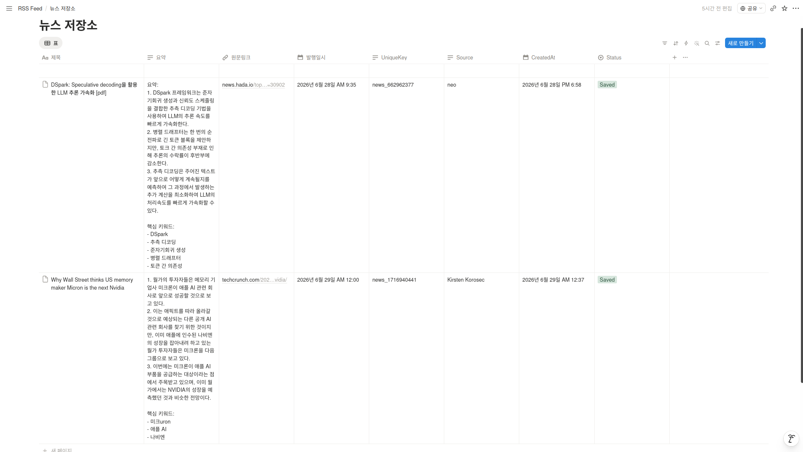

# 산출물 2. Notion 데이터베이스 페이지./images


## 1. Notion 뉴스 저장소 DB 페이지

본 프로젝트에서 자동 수집·요약된 AI 뉴스는 Notion 데이터베이스에 저장된다.  
n8n 워크플로우는 RSS에서 수집한 뉴스 중 AI 관련 기사만 선별하고, 중복 여부를 확인한 뒤, Ollama로 요약한 결과를 아래 Notion DB에 저장한다.

### Notion DB 링크

https://app.notion.com/p/38d525e5df75801ca985fa1e2c86d6bf?v=38d525e5df758009bf86000c411d7d95&source=copy_link

---


## 2. Notion 데이터베이스 화면

아래 화면은 n8n 워크플로우를 통해 뉴스 데이터가 저장되는 Notion 데이터베이스 페이지이다.



---


## 3. 데이터베이스 목적

Notion 뉴스 저장소 DB는 AI 관련 최신 뉴스를 구조적으로 저장하기 위한 공간이다.

이 데이터베이스는 다음 목적을 가진다.

| 목적           | 설명                                             |
| -------------- | ------------------------------------------------ |
| 뉴스 아카이빙  | 매일 수집된 AI 관련 뉴스를 누적 저장             |
| 요약 정보 관리 | Ollama가 생성한 한국어 요약 결과 저장            |
| 원문 접근      | 원문 링크를 저장하여 필요 시 기사 원문 확인 가능 |
| 중복 방지      | UniqueKey를 통해 동일 기사 반복 저장 방지        |
| 출처 관리      | 뉴스가 수집된 RSS 출처 기록                      |
| 실행 상태 확인 | 저장 성공 여부와 생성 시각 확인                  |

---


## 4. Notion 데이터베이스 속성 구조

Notion 데이터베이스는 뉴스 제목, 요약, 링크, 발행일, 출처, 중복 방지 키 등을 저장할 수 있도록 구성하였다.

| 속성명    | Notion 속성 타입 | 저장 내용        | 설명                                           |
| --------- | ---------------- | ---------------- | ---------------------------------------------- |
| 제목      | Title            | 뉴스 기사 제목   | Notion 페이지의 대표 제목으로 사용             |
| 요약      | Text / Rich Text | Ollama 요약 결과 | 한국어 요약 3개와 핵심 키워드 저장             |
| 원문링크  | URL              | 기사 원문 URL    | 원본 뉴스 페이지로 이동하기 위한 링크          |
| 발행일시  | Date             | RSS 기사 발행일  | 뉴스가 실제 발행된 날짜와 시간                 |
| UniqueKey | Text / Rich Text | 링크 기반 해시값 | 중복 저장 여부를 판단하는 고유값               |
| Source    | Text / Select    | 뉴스 출처        | TechCrunch, MIT Technology Review, GeekNews 등 |
| CreatedAt | Date             | Notion 저장 시각 | 워크플로우가 해당 데이터를 저장한 시간         |
| Status    | Select / Text    | 처리 상태        | Saved, Duplicate, NoNews 등 처리 결과 표시     |

---


## 5. n8n 워크플로우와 Notion DB 속성 매핑

n8n 워크플로우에서 처리된 데이터는 다음과 같이 Notion 속성에 매핑된다.

| n8n 데이터 필드              | Notion 속성 | 설명                                     |
| ---------------------------- | ----------- | ---------------------------------------- |
| `title`                      | 제목        | RSS에서 가져온 기사 제목                 |
| `summary` 또는 Ollama 응답값 | 요약        | Ollama가 생성한 한국어 요약문            |
| `link`                       | 원문링크    | 기사 원문 URL                            |
| `pubDate`                    | 발행일시    | RSS에서 제공된 기사 발행일               |
| `uniqueKey`                  | UniqueKey   | 기사 링크를 기반으로 생성한 중복 방지 키 |
| `source`                     | Source      | 기사가 수집된 RSS 출처                   |
| 현재 실행 시각               | CreatedAt   | Notion에 저장된 시각                     |
| `status`                     | Status      | 저장 처리 상태                           |

---


## 6. 저장 데이터 예시

정상적으로 워크플로우가 실행되면 Notion DB에는 다음과 같은 형태로 뉴스가 저장된다.

| 속성      | 예시                                                         |
| --------- | ------------------------------------------------------------ |
| 제목      | OpenAI releases new AI model for developers                  |
| 요약      | 1. OpenAI가 개발자를 위한 새로운 AI 모델을 공개했다. <br> 2. 이 모델은 기존 모델보다 빠른 응답 속도와 개선된 추론 성능을 제공한다. <br> 3. 기업과 개발자는 API를 통해 다양한 서비스에 해당 모델을 적용할 수 있다. <br><br> 핵심 키워드: OpenAI, AI 모델, 개발자 API |
| 원문링크  | `https://example.com/openai-new-model`                       |
| 발행일시  | 2026-06-29 09:00                                             |
| UniqueKey | `news_123456789`                                             |
| Source    | TechCrunch AI                                                |
| CreatedAt | 2026-06-29 09:01                                             |
| Status    | Saved                                                        |

---


## 7. 중복 방지 구조

본 워크플로우는 동일한 뉴스가 반복 저장되는 문제를 방지하기 위해 `UniqueKey` 속성을 사용한다.

### 7.1 UniqueKey 생성 기준

`UniqueKey`는 기사 원문 링크를 기반으로 생성된다.

```text
기사 원문 링크 → 해시 변환 → UniqueKey 생성
```


예시:

```
https://example.com/openai-new-model
→ news_123456789
```

기사 링크가 없는 경우에는 `guid` 또는 `title` 값을 대체 기준으로 사용할 수 있다.

------

### 7.2 Notion 중복 확인 방식

n8n은 Notion 저장 전에 데이터베이스를 먼저 조회한다.

조회 조건은 다음과 같다.

text

```
UniqueKey equals 현재 기사 UniqueKey
```

처리 흐름은 다음과 같다.

text

```
1. RSS에서 기사 수집
2. 기사별 UniqueKey 생성
3. Notion DB에서 동일한 UniqueKey 검색
4. 동일 값이 있으면 중복으로 판단
5. 동일 값이 없으면 Ollama 요약 후 Notion에 저장
```

------


## 8. 저장 상태 관리

`Status` 속성은 뉴스 처리 결과를 확인하기 위해 사용한다.

| Status 값 | 의미                                      |
| --------- | ----------------------------------------- |
| Saved     | 신규 뉴스가 정상적으로 요약되어 저장됨    |
| Duplicate | 이미 저장된 뉴스로 판단되어 저장하지 않음 |
| NoNews    | AI 관련 뉴스가 없어 저장하지 않음         |
| Error     | RSS, Ollama, Notion 처리 중 오류 발생     |

실제 Notion DB에는 일반적으로 저장된 뉴스만 남기며, 실행 실패나 중복 여부는 n8n 실행 로그에서도 확인할 수 있다.

------


## 9. Notion 저장 과정

Notion DB 저장 과정은 다음 순서로 이루어진다.

text

```
AI 관련 뉴스 필터링
        ↓
최신 기사 1건 선택
        ↓
UniqueKey 생성
        ↓
Notion DB 중복 조회
        ↓
중복이 아니면 Ollama 요약 실행
        ↓
Notion DB에 저장
```

이 구조를 통해 Notion에는 중복되지 않은 최신 AI 뉴스만 저장된다.

------


## 10. Notion DB 활용 방법

저장된 뉴스 데이터는 다음과 같이 활용할 수 있다.

| 활용 방법           | 설명                                          |
| ------------------- | --------------------------------------------- |
| 최신 AI 뉴스 확인   | 매일 자동 저장된 AI 뉴스를 Notion에서 확인    |
| 요약 기반 빠른 파악 | 긴 원문을 읽지 않고 요약만으로 핵심 내용 파악 |
| 원문 링크 이동      | 필요 시 원문링크를 클릭하여 상세 기사 확인    |
| 출처별 분류         | Source 속성으로 뉴스 출처 구분                |
| 날짜별 정렬         | 발행일시 또는 CreatedAt 기준으로 최신순 정렬  |
| 중복 관리           | UniqueKey를 통해 동일 기사 저장 여부 확인     |

------


## 11. 데이터베이스 설계 특징

본 Notion 데이터베이스는 자동화 결과를 관리하기 위해 다음과 같은 특징을 가진다.

| 특징              | 설명                                                 |
| ----------------- | ---------------------------------------------------- |
| 구조화된 저장     | 제목, 요약, 링크, 날짜, 출처를 분리하여 저장         |
| 자동 요약 반영    | Ollama가 생성한 한국어 요약 결과 저장                |
| 중복 방지 가능    | UniqueKey를 사용하여 동일 기사 반복 저장 방지        |
| 검색 및 정렬 용이 | 제목, 날짜, 출처 기준으로 검색과 정렬 가능           |
| 원문 접근성 확보  | URL 속성을 통해 원문 기사로 바로 이동 가능           |
| 실행 결과 추적    | CreatedAt과 Status로 저장 시점과 처리 상태 확인 가능 |

------


## 12. 결론

Notion 뉴스 저장소 DB는 n8n 자동화 워크플로우의 최종 저장 공간이다.

RSS에서 수집된 AI 관련 뉴스는 필터링, 최신 기사 선택, 중복 확인, Ollama 요약 과정을 거친 뒤 Notion DB에 저장된다.
각 뉴스는 제목, 요약, 원문링크, 발행일시, UniqueKey, Source, CreatedAt, Status 속성으로 구조화되어 관리된다.

이를 통해 사용자는 매일 자동으로 정리된 AI 뉴스를 Notion에서 확인할 수 있으며, 중복 없이 최신 뉴스 요약 아카이브를 유지할 수 있다.
